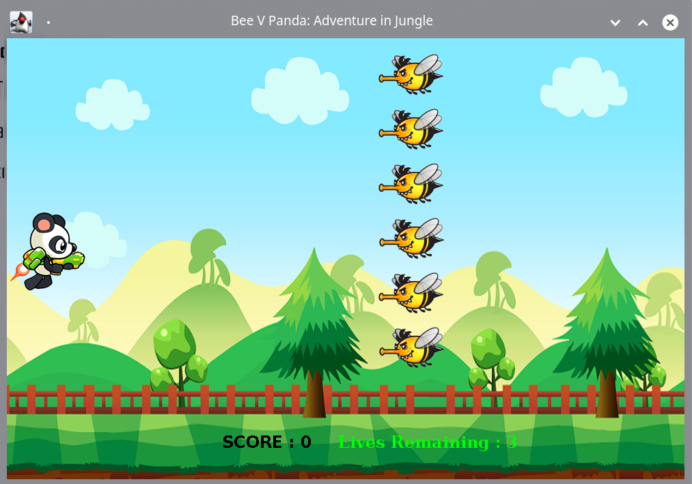

# Bees VS Panda

  >*Bees vs Panda is one of the nostalgic mobile game. More or less our generation played this game on Phone. In this game Panda fires at bees and avoid touching the bees. If bees touch panda three times then game will over and dismissing bees give points.*


## Features
- [ ] User Profile
- [ ] Multiple level
- [ ] Level up by killing Queen bee 
- [ ] Show highest Score
- [ ] New Life feature
- [ ] Gun Power up 
- [ ] Change background on every Level
- [ ] Change Panda Avatar
- [ ] Make faster bees appearance according to Level
- [ ] Resume Game from last played level with points

## Platform
Cross platform Applicaiton. Runs on `Windows / GNU Linux / Mac OS/ BSD`

## Execution 
1)  Install `Java 1.8`  or `Adopt JDK 1.8`
2)  Download [Jar](https://github.com/samiurprapon/BeesVsPanda/releases).  (later)
3)  Open `console` or `command promp` or `terminal` and execute this code
```
java <packageName.jar>
```
Package name will be the `.jar` file name

## Build and Installation
1) clone this repository 
```
git clone https://github.com/samiurprapon/BeesVsPanda.git
```
2) Open `Intelij idea` and open `BeesVsPanda`
3) Open `/src/bvp/Main.java`
4) Run this `Main.main`

## Programming Languages 
> Java

## Tools/framework
> Intellij IDEA
> Scene Builder

## References
> N/A


### Team Information
```
Author          :   Samiur Rahman Prapon,
                    ID # 1712666642
                    
                    Mushfikul Islam
                    ID # 1712461042

Project Owner   :   Samiur Rahman Prapon

Scrum Master    :   Mushfikul Islam

Submitted to    :   Javed Hossain
                    Lecturer,
                    Department of Electrical & Computer Engineering
                    North South University, Bangladesh.

Submission Date :   7/01/2021
```

  ## Preview
  >
  
  
## Acknowledgements
* This codebase is heavily borrowed from [Shaynur Akash](https://www.facebook.com/shaynur.akash.3).
* Special thanks for [Rahat Anwar](https://www.facebook.com/rahat.anwar.5) for giving me this code to enhance, clean and format.

## License
This project is licensed under [GPL-3.0 License](https://opensource.org/licenses/GPL-3.0).  
Copyright (c) 2020 [Samiur Prapon](https://samiurprapon.github.io/).